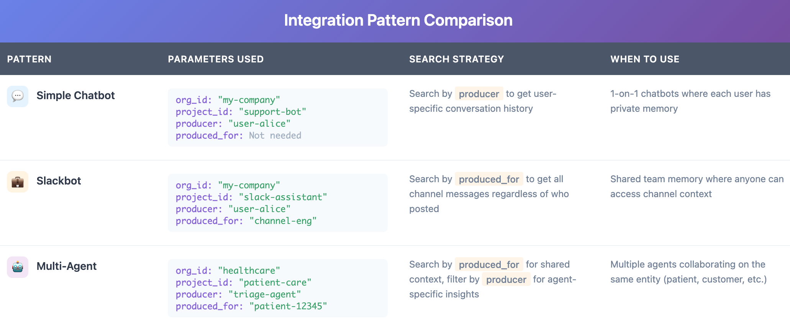

## Introduction

Building an AI agent that remembers? The technical challenge isn't just storing conversations—it's knowing when to retrieve context, how to organize it, and where to inject it into your workflow.

MemMachine is an open-source memory layer designed specifically for agent workflows. Whether you're building a customer support bot, a Slackbot, or a multi-agent system, MemMachine acts as middleware that intercepts messages, stores relevant information, and enriches context before your LLM responds.

This guide walks through how to integrate MemMachine into your agent architecture using the Python SDK or REST API, with a focus on the practical workflow decisions you'll need to make.

## The Agent Workflow with MemMachine

In most AI applications, MemMachine acts as the middleman between the user and your agent. Whether you have a customer support chatbot, Slackbot, or any other agent, MemMachine reads in all the information so it can be referenced as context in future interactions.

```text
User Message → MemMachine (Retrieve Context) → Enriched Prompt → LLM → Response → MemMachine (Store)
```

The workflow has two key integration points:

1. **Before LLM Processing**: MemMachine retrieves relevant memories and enriches your prompt with context
2. **After LLM Response**: MemMachine stores the interaction for future recall (optional, depending on your needs)

Depending on how you configure it, you can make MemMachine respond only when needed or continuously store every interaction. This flexibility lets you control the balance between memory richness and storage efficiency.

## Memory Architecture: What Gets Stored and How

MemMachine organizes memory into two distinct types, mirroring human memory systems:


### 1. Episodic Memory

Episodic memory captures the narrative of conversations—the what, when, and how of interactions. It's stored in a graph database (Neo4j) to preserve temporal relationships and conversational flow.

**What it stores:**

- Conversational context and dialogue history
- Temporal sequences ("User asked about Python on Monday, then Django on Tuesday")
- Relationship connections between topics and events

**Use cases:**

- "What did we discuss last week?"
- "Show me the evolution of this project"
- "Recall our conversation about database design"

### 2. Semantic Memory (Profile Memory)

Semantic memory extracts long-term facts and preferences—the enduring truths about users, independent of specific conversations. It's stored in SQL databases for efficient querying.

**What it stores:**

- User preferences ("prefers dark mode", "vegetarian")
- Persistent facts ("knows Python", "works in healthcare")
- Skills and expertise ("experienced with React", "beginner at ML")

**Use cases:**

- "What are my dietary preferences?"
- "What technologies does this user know?"
- "What's my investment risk tolerance?"

## Configuring Memory Types for Your Use Case

Developers can configure their agents to selectively use either semantic or episodic memory. Some use cases might not benefit from semantic memory—for instance, transactional workflows where long-term profile building isn't needed, or privacy-sensitive applications where you only want conversational context without persistent user profiling.

This dual-memory architecture ensures your AI can both recall specific conversations and build up generalized knowledge about users over time, with the flexibility to use only what your application needs.

## Understanding Isolation Parameters

Before integrating MemMachine, you need to understand how it organizes and isolates memories. MemMachine uses a straightforward identifier structure to ensure memories are properly scoped:

## Core Isolation Parameters

**`org_id` (Organization ID)**

- Top-level identifier for organizational isolation
- Separates completely independent tenants or deployments
- Example: "my-org", "company-a", "company-b"

**`project_id` (Project ID)**

- Identifies a specific application or use case within an organization
- Separates different products, services, or workflows
- Example: "customer-support", "sales-assistant", "patient-care"

**`producer` (Producer)**

- Identifies who or what created the memory
- In simple chatbot scenarios, effectively functions as a user identifier - when searching for a user's memories, filter by their `producer` value
- Used for filtering and attribution during retrieval
- Example: "user-alice", "user-12345", "triage-agent"

**`produced_for` (Produced For)**

- Identifies who the memory is intended for or about
- Useful in multi-agent systems where memories need to be shared or directed to specific agents
- Example: "agent-bob", "patient-12345", "support-team"

## How Isolation Works in Practice

When you make a memory operation (search, add, delete), MemMachine uses these parameters to scope the operation:

```text
org_id: my-org
 └── project_id: customer-support
 ├── producer: user-alice (who created it / user identifier)
 └── produced_for: agent-bob (who it's for)
```

Simple Chatbot Pattern: For a basic chatbot, you typically only need `org_id`, `project_id`, and `producer`. Set `producer` to the user's ID, and when that user asks a question, search for memories where `producer` matches their ID. This retrieves all that user's past conversations and context.

These parameters are passed in the request body (REST API) or as part of the memory context (Python SDK), ensuring that memory operations are automatically scoped to the appropriate boundaries.

## Choosing Your Isolation Strategy

**Simple Chatbot**: Use `org_id` for your application, `project_id` for the bot type, and `producer` as the user identifier. Search memories by `producer` to get user-specific context.

**Multi-Tenant SaaS**: Use `org_id` to represent each customer company, `project_id` for different modules they use, and `producer` to identify individual users within each company.

**Multi-Agent Systems**: Use `producer` to identify which agent created which memories, and `produced_for` to specify which user or entity the memory is about or shared with.

**User Personalization**: Use `producer` to scope memories to specific users, enabling personalized context retrieval based on their interaction history.

## Integrating MemMachine: Python SDK & REST API

MemMachine offers many ways to integrate into your application—including platforms like n8n, Dify, and MCP—but this guide focuses on the two foundational methods that give you direct control: the Python SDK and REST API. Let's explore when and how to use each approach.

## Method 1: Python SDK Integration

**Best for**: Native Python applications, data science workflows, microservices

The Python SDK provides idiomatic Python classes with connection pooling, automatic retry logic, and clean abstractions. It's the fastest way to add memory to Python applications.

**The Integration Flow**:

1. Initialize - Create a MemMachine client and connect to your project using `org_id` and `project_id`
2. Retrieve - Before sending messages to your LLM, search for relevant memories using semantic similarity
3. Enrich - Build enriched context by combining the current message with retrieved memories
4. Generate - Send the enriched context to your LLM for a personalized response
5. Store - After the LLM responds, store the conversation turn with `producer` (user ID) and optionally `produced_for`

The SDK handles all the complexity of memory management—connection pooling, retry logic, and efficient serialization—so you can focus on building your application logic.

Simple Chatbot Example:

```python
# Create or get project
project = client.get_or_create_project(
 org_id="my-org",
 project_id="chatbot"
)
# User asks a question - retrieve their memories
user_id = "user-alice"
memory = project.get_or_create_memory()
# Search for this user's previous conversations
results = memory.search(
 query="what are my preferences?",
 top_k=5,
 filters={"producer": user_id} # Get only this user's memories
)
# After LLM responds, store the new conversation
memory.add(
 messages=[
 {
 "content": "I prefer dark mode",
 "producer": user_id, # Tag with user ID
 "role": "user"
 }
 ]
)
```

**Key Operations:**
- `memory.search()` - Retrieve relevant memories, filter by `producer` for user-specific context
- `memory.add()` - Store new conversation turns with `producer` as user identifier
- `memory.get()` - Fetch specific memories by ID
- `memory.delete()` - Remove outdated or incorrect memories

**When to use:** Building custom applications, need fine-grained control, working in Python ecosystem.

[Full Python SDK Documentation & Code Examples →](https://github.com/MemMachine/MemMachine/blob/main/docs/api_reference/python/client.mdx)

**Best for:** Polyglot environments, microservices architectures, language-agnostic systems

The REST API provides HTTP endpoints accessible from any programming language. Perfect when you need flexibility or are building multi-service architectures.

**How It Works:**

MemMachine exposes standard REST endpoints for all memory operations. Your application makes HTTP requests to store, search, and retrieve memories. All isolation parameters are passed in the request body as JSON.

**Core Endpoints:**
- `POST /api/v2/memories` - Store new memories
- `POST /api/v2/memories/search` - Search for relevant context
- `POST /api/v2/memories/episodic/delete` - Remove episodic memories
- `POST /api/v2/memories/semantic/delete` - Remove semantic memories

**Simple Chatbot Example:**

**Adding a user's memory:**

```json
{
 "org_id": "my-org",
 "project_id": "chatbot",
 "messages": [
 {
 "content": "I prefer dark mode",
 "producer": "user-alice", // User identifier
 "role": "user"
 }
 ]
}
```

Searching that user's memories:

```json
{
 "org_id": "my-org",
 "project_id": "chatbot",
 "query": "what are my preferences?",
 "top_k": 5,
 "filters": {
 "producer": "user-alice" // Get only this user's memories
 }
}
```

For multi-agent scenarios, you can also use `produced_for` to share memories between agents or direct them to specific recipients.

**When to use**: Multi-language environments, distributed systems, need HTTP-based integration, building microservices.

[Full REST API Reference & Examples →](https://docs.memmachine.ai/examples/rest)

## Getting Started with MemMachine

Ready to integrate MemMachine? Start with the deployment that matches your environment:

**For local development and testing**, the Docker Compose setup gets you running in minutes. For production deployments, MemMachine supports cloud platforms (AWS, GCP, Azure), on-premises installations, and direct Python package installation.

[Complete Quickstart Guide →](https://github.com/MemMachine/MemMachine/blob/main/docs/getting_started/quickstart.mdx)

Once MemMachine is running, you can integrate it using the Python SDK or REST API depending on your stack.

## Integration Patterns for Common Use Cases



Pattern 1: Simple Chatbot with User Memory

**Scenario**: Chatbot that remembers each user's conversation history and preferences

**Isolation Strategy**:
- `org_id: "my-company"`
- `project_id: "support-bot"`
- `producer: "user-alice"` (User identifier, e.g. "user-12345")
- `produced_for`: Not needed for this simple case

**How it works**: When storing a conversation, set `producer` to the user's ID. When that user returns, search for memories where `producer` matches their ID to retrieve their conversation history and context. This gives you personalized responses without needing additional parameters.

Pattern 2: Slackbot with Channel Memory

**Scenario**: Slackbot that maintains shared context within channels, allowing anyone in the channel to search the channel's history

**Isolation Strategy**:
- `org_id: "my-company"`
- `project_id: "slack-assistant"`
- `producer: "user-alice"` (User who created the message, e.g. "user-bob")
- `produced_for: "channel-engineering"` (Channel identifier, e.g. "channel-marketing")

**How it works**: When someone posts in a Slack channel, store the message with `producer` set to the user who posted it, and `produced_for` set to the channel ID. When anyone in that channel asks a question, search for memories where `produced_for` matches the channel ID—this retrieves all messages from that channel regardless of who originally posted them. This enables shared team knowledge that anyone in the channel can access.

Example: Alice posts "We're using PostgreSQL for the new project" in #engineering (stored with `producer: "alice"`, `produced_for: "channel-engineering"`). Later, Bob asks "What database are we using?" in the same channel. The bot searches memories where `produced_for: "channel-engineering"` and finds Alice's message, even though Bob wasn't the original producer.

Pattern 3: Multi-Agent System with Shared Context

**Scenario**: Multiple specialized agents collaborating with shared context about the same entity

**Isolation Strategy:**
- `org_id: "healthcare-provider"`
- `project_id: "patient-care"`
- `producer: "triage-agent"` (Agent identifier, e.g. "diagnosis-agent", "treatment-agent")
- `produced_for: "patient-12345"` (Entity identifier)

**How it works**: Each agent stores memories with its own `producer`, all tagged `produced_for` the same patient. Any agent can search for memories where `produced_for: "patient-12345"` to access the complete shared context. Filter by `producer` when you need agent-specific insights.

## Best Practices for Integration

### 1. Strategic Memory Storage

Don't store everything—be selective. Store facts, preferences, and key decisions, but skip repetitive or transient information. Quality over quantity ensures your memory searches return truly relevant context rather than noise.

### 2. Smart Context Retrieval

Use semantic search with appropriate limits. More isn't always better—focus on relevance. Typically 3-5 memories provide enough context without overwhelming the LLM. Experiment to find the sweet spot for your use case.

### 3. Privacy and Isolation

Always scope memory appropriately using the isolation parameters. Use `produced_for` to identify intended recipients, and ensure your `org_id` and `project_id` structure provides proper data boundaries. Memory should enhance personalization while maintaining privacy.

### 4. Handle Memory Gracefully

Memory operations can fail—network issues, database errors, or service interruptions. Always implement fallback behavior so your application can continue functioning (even if less personalized) when memory is unavailable.

## Conclusion: Building Memory-Aware Agents

Integrating MemMachine into your agent workflow comes down to three key decisions:

1. **How will you isolate memories?** - Define your `org_id` and `project_id` for organizational boundaries, then use `producer` and `produced_for` to track who creates memories and who they're intended for
2. **Which integration method fits your stack?** - Choose Python SDK for Python applications or REST API for polyglot environments
3. **What memory types does your agent need?** - Configure episodic memory for conversational context, semantic memory for long-term facts, or both

MemMachine's middleware architecture means these decisions can be made independently from your LLM choice, agent framework, or deployment infrastructure. The memory layer becomes a clean abstraction that enhances your agent without coupling to your implementation details.

Whether you're building a multi-tenant SaaS platform or a collaborative multi-agent system, MemMachine's isolation parameters give you the flexibility to structure memory exactly how your application needs it.

Ready to add memory to your agent? Start with the [Quickstart Guide](https://github.com/MemMachine/MemMachine/blob/main/docs/getting_started/quickstart.mdx) to get MemMachine running, then integrate using the [Python SDK](https://github.com/MemMachine/MemMachine/blob/main/docs/api_reference/python/client.mdx) or [REST API](https://docs.memmachine.ai/examples/rest) depending on your needs.

